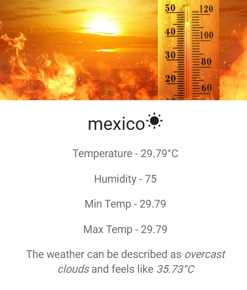
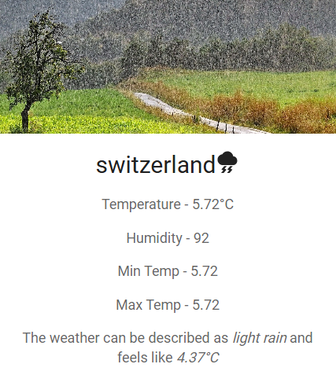

# ⛅ Dynamic Weather UI (React.js + Material-UI) 🌡

Dynamic Weather UI is a **responsive, real-time weather interface** that visually adapts based on live temperature and humidity data. Crafted with **React.js** and **Material-UI**, it offers a sleek, modern user experience featuring dynamic visuals, informative cards, and animated weather icons.

---

🔗 **Live Demo:** [View App](https://dynamic-weather-ui.vercel.app/)  

---

## 🚀 Features

### 📍 General Features
- 🌇 Displays **City Name**, **Current Temperature**, **Humidity**, **Min/Max Temperature**
- 🔁 **Real-Time Weather Data** updates from a live API
- 📱 **Responsive Design** for mobile, tablet, and desktop

### 🌈 Dynamic Visuals
- 🖼️ **Auto-switching background themes** based on weather conditions:
  - **High Humidity (>80%)** – Rainy Theme 🌧️
  - **Temperature > 15°C** – Hot Theme 🔥
  - **Temperature ≤ 15°C** – Cold Theme ❄️
- 🌤️ Weather icons dynamically adjust using **Material-UI**:
  - ☀️ `WbSunny` for sunny days  
  - ❄️ `AcUnit` for cold days  
  - ⚡ `Thunderstorm` for rainy conditions

---

## 🛠 Tech Stack

### 💻 Frontend
- **React.js**
- **JavaScript (ES6+)**
- **Vite.js** (for lightning-fast development)
- **Material-UI (MUI)**
- **CSS (Component-scoped styling)**

### 🌐 API
- **OpenWeatherMap API** (or any other live weather API)

---

## 📸 Screenshots

| Light Theme (Sunny) | Cold Theme | Rainy Theme |
|---------------------|------------|-------------|
|  |  |  |


## 🧪 Setup & Installation

```bash
# Clone the repository
git clone https://github.com/your-username/dynamic-weather-ui.git
cd dynamic-weather-ui

# Install dependencies
npm install

# Start development server
npm run dev
